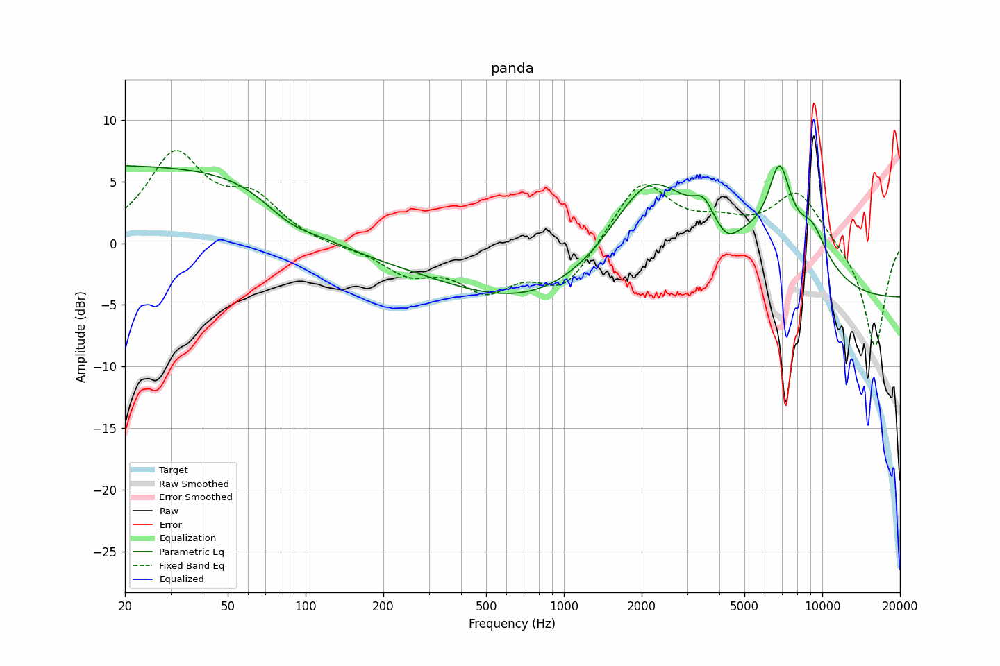

# panda
See [usage instructions](https://github.com/jaakkopasanen/AutoEq#usage) for more options and info.

### Parametric EQs
You can use filters 1-5 or 1-10. Apply preamp of -6.5 dB or -6.4 dB, respectively.

|   # | Type      |   Fc (Hz) |    Q |   Gain (dB) |
|-----|-----------|-----------|------|-------------|
|   1 | LowShelf  |       105 | 0.7  |         6.4 |
|   2 | Peaking   |        86 | 1.18 |        -2.3 |
|   3 | Peaking   |       798 | 0.38 |        -5.1 |
|   4 | Peaking   |      2120 | 0.92 |         7.4 |
|   5 | Peaking   |      6836 | 3.21 |         6   |
|   6 | Peaking   |      3471 | 3.69 |         1.6 |
|   7 | Peaking   |      4274 | 2.9  |        -0.6 |
|   8 | Peaking   |      4295 | 3.06 |        -0.9 |
|   9 | Peaking   |      9170 | 2.53 |         2.3 |
|  10 | HighShelf |     10000 | 0.7  |        -4.4 |

### Fixed Band EQs
When using fixed band (also called graphic) equalizer, apply preamp of **-7.6 dB** (if available) and set gains manually with these parameters.

|   # | Type    |   Fc (Hz) |    Q |   Gain (dB) |
|-----|---------|-----------|------|-------------|
|   1 | Peaking |        31 | 1.41 |         7   |
|   2 | Peaking |        62 | 1.41 |         3.2 |
|   3 | Peaking |       125 | 1.41 |        -0.3 |
|   4 | Peaking |       250 | 1.41 |        -2.2 |
|   5 | Peaking |       500 | 1.41 |        -3.3 |
|   6 | Peaking |      1000 | 1.41 |        -3.6 |
|   7 | Peaking |      2000 | 1.41 |         5.2 |
|   8 | Peaking |      4000 | 1.41 |         1.2 |
|   9 | Peaking |      8000 | 1.41 |         4.2 |
|  10 | Peaking |     16000 | 1.41 |        -8.6 |

### Graphs

